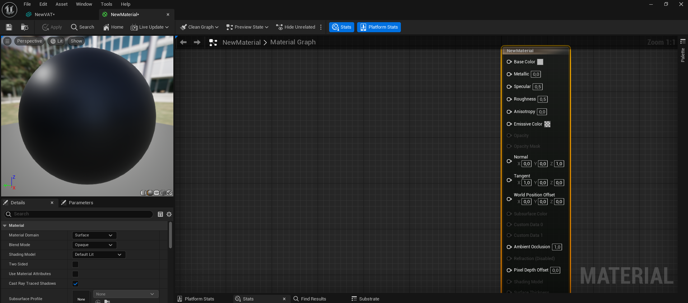
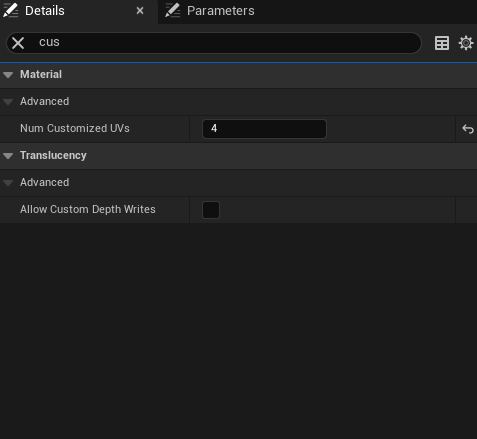
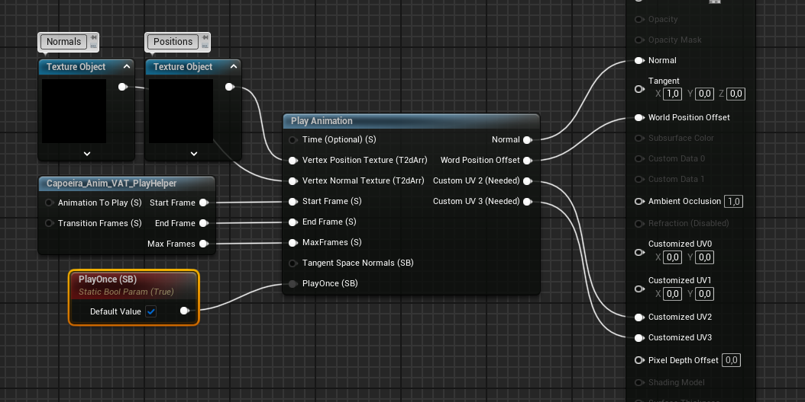

# Material Setup
- Open the **Static Mesh** and Edit existing or Create a new Material  

    

- Set **Num Customized UVs** to 4  

    

- Add and connect generated textures as **Texture Object** to their corresponding pin.
   Use **Play Helper** to ease animation control. Connect everything else.  

    

<!-- For a detailed reference, see  -->