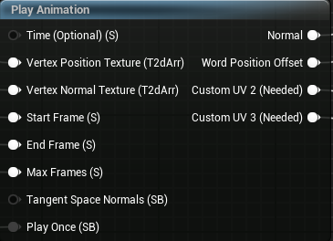

# Play Animation

::: tip
Use this node inside your static mesh material to play vertex animation.
:::

## Inputs

==- Time
Connect this if you want to control the animation time yourself.  
By default, it is set to Time node multiplied by 30.  
You should use this pin if you want to control the speed of your animation.
===

==- Vertex Position Texture
This is the pin to which you should connect your generated position texture array.
===

==- Vertex Normal Texture
This is the pin to which you should connect your generated normal texture array.
===

==- Start Frame
Frame index from which your animation will start.
===

==- End Frame
Frame index where your animation stops or loops.
===

==- Max Frames
You need to set this to total frames of your animation.
===

==- Tangent Space Normals

!!!
If disabled, make sure to disable them inside material properties.
!!!

By default this is <b>True</b> because it allows blending normals. But tangent space normals can sometimes produce artifacts, so you can turn it off.  
===

==- Play Once
Set this to <b>True</b> if you want your animation to stop at the last frame (End Frame).  
===

## Outputs

==- Normal
Returns calculated normals from your textures, connect this to your material normal pin.  

::: tip
If your model already uses a normal map, you can use <b>BlendAngleCorrectedNormals</b> node.
:::
===

==- World Position Offset
Returns calculated position offsets from your texture, connect this to your material <b>World Position Offset</b> pin.  
===

==- Custom UV 2

!!!
Make sure <b>Num Customized UVs</b> is set to <b>4</b>
!!!

Connect this to <b>Customized UV2</b> pin.
===

==- Custom UV 3

!!!
Make sure  <b>Num Customized UVs</b> is set to <b>4</b>
!!!

Connect this to <b>Customized UV3</b> pin.
===