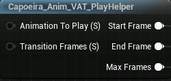

# Play Helper

::: tip
Use this node to easily handle switching between multiple animations.
:::

## Inputs

==- Animation To Play
Index of an animation you want to play.
===

==- Transition Frames
Number of final frames to take from the previous animation. 
Use this if you want finer transitions and don't need looping.
===

## Outputs

==- Start Frame
Connect this to  pin of Play Animation node.
===

==- End Frame
Connect this to  pin of Play Animation node.
===

==- Max Frames
Connect this to  pin of Play Animation node.
===