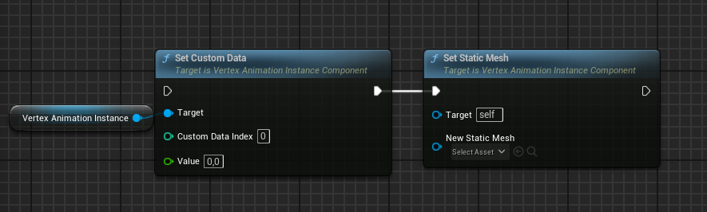

# Vertex Animation Instance (component)

Use this if you want to use vertex animations for individual actors in the scene.
For each actor that contains the component, this component will create and update ISM / HISM instances automatically.

To use it, simply add this component to your actor and set its **Static Mesh**. Instance of it will be created based on actors transform.

## Properties

## Functions
